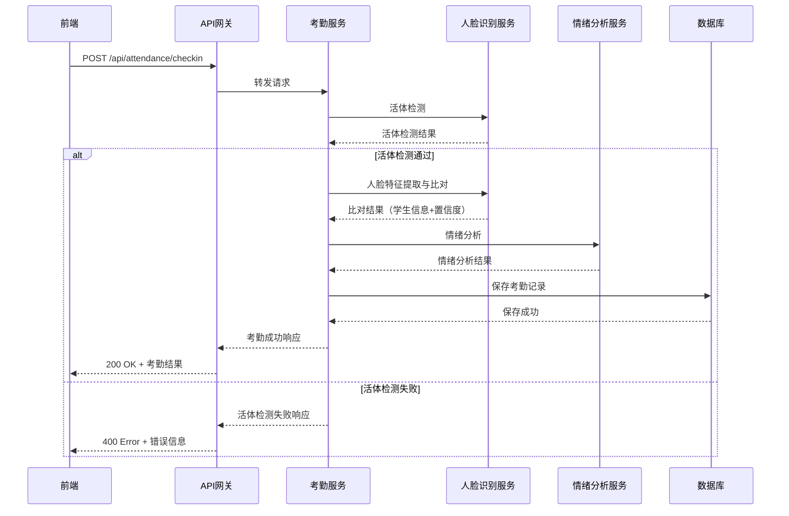

# 专业考勤系统 - 项目架构设计文档

## 1. 项目概述

本项目是一套基于人脸识别与活体检测技术的专业考勤系统，采用 Browser/Server (B/S) 架构，整合合照学生识别与学生面部情绪分析功能，旨在实现安全、高效、智能的考勤管理。

## 2. 系统架构设计

### 2.1 整体架构

```
┌─────────────────────────────────────────────────────────────────────┐
│                         前端层 (Frontend)                           │
│  ┌─────────────┐ ┌─────────────┐ ┌─────────────┐ ┌─────────────┐   │
│  │ 实时考勤模块 │ │ 合照上传模块 │ │ 情绪分析模块 │ │ 数据报表模块 │   │
│  └──────┬──────┘ └──────┬──────┘ └──────┬──────┘ └──────┬──────┘   │
└─────────┼────────────────┼────────────────┼────────────────┼─────────┘
          │                │                │                │
          ▼                ▼                ▼                ▼
┌─────────────────────────────────────────────────────────────────────┐
│                     API网关层 (API Gateway)                         │
│                    统一认证、请求路由、负载均衡                        │
└───────────────────────────┬─────────────────────────────────────────┘
                            │
          ┌─────────────────┼─────────────────┐
          ▼                 ▼                 ▼
┌─────────────────┐ ┌─────────────────┐ ┌─────────────────┐
│   业务逻辑层     │ │   算法服务层     │ │   数据访问层     │
│ (Business Logic)│ │ (Algorithm Core)│ │  (Data Access)  │
│ ┌─────────────┐ │ │ ┌─────────────┐ │ │ ┌─────────────┐ │
│ │ 考勤业务    │ │ │ │ 活体检测    │ │ │ │ MySQL       │ │
│ │ 合照识别业务│ │ │ │ 人脸特征提取│ │ │ │ Redis缓存  │ │
│ │ 情绪分析业务│ │ │ │ 人脸比对    │ │ │ │ 文件存储   │ │
│ │ 数据统计业务│ │ │ │ 情绪分类    │ │ │ │             │ │
│ └─────────────┘ │ │ └─────────────┘ │ │ └─────────────┘ │
└─────────────────┘ └─────────────────┘ └─────────────────┘
```

### 2.2 技术栈

| 层级 | 技术 | 版本 | 说明 |
|------|------|------|------|
| 前端 | Vue.js | 3.x | 响应式Web框架 |
| 前端 | Element Plus | 2.x | UI组件库 |
| 前端 | Chart.js | 4.x | 图表可视化 |
| 前端 | WebRTC | - | 摄像头实时采集 |
| 后端 | Flask | 2.3.x | Python轻量级Web框架 |
| 后端 | Flask-RESTful | 0.3.9 | RESTful API扩展 |
| 后端 | Flask-JWT-Extended | 4.5.x | JWT认证 |
| 后端 | MySQL | 8.0+ | 关系型数据库 |
| 后端 | Redis | 7.0+ | 缓存服务 |
| 算法 | OpenCV-Python | 4.8.x | 图像处理 |
| 算法 | MTCNN | 0.1.x | 人脸检测 |
| 算法 | Facenet-PyTorch | 2.5.x | 人脸特征提取 |
| 算法 | PyTorch | 2.0+ | 深度学习框架 |
| 算法 | TorchVision | 0.15+ | 计算机视觉工具库 |

### 2.3 核心组件说明

#### 2.3.1 前端组件

| 组件 | 功能说明 |
|------|----------|
| `AttendanceCamera.vue` | 摄像头实时预览、人脸采集、拍摄控制 |
| `GroupPhotoUpload.vue` | 合照上传、图片预览、格式校验 |
| `EmotionChart.vue` | 情绪分布统计图表（饼图、柱状图） |
| `AttendanceRecord.vue` | 考勤记录列表、状态筛选、详情查看 |
| `StatisticsReport.vue` | 统计报表、数据导出（Excel） |

#### 2.3.2 后端服务

| 服务 | 功能说明 |
|------|----------|
| `attendance_service.py` | 考勤业务逻辑处理 |
| `face_recognition_service.py` | 人脸识别核心算法调用 |
| `emotion_analysis_service.py` | 情绪分析算法调用 |
| `student_service.py` | 学生信息管理 |
| `report_service.py` | 报表生成与导出 |

#### 2.3.3 数据库表设计

**student_info（学生信息表）**

| 字段名 | 类型 | 约束 | 说明 |
|--------|------|------|------|
| student_id | VARCHAR(20) | PRIMARY KEY | 学号 |
| name | VARCHAR(50) | NOT NULL | 姓名 |
| class_name | VARCHAR(50) | NOT NULL | 专业 |
| face_feature | TEXT | - | 人脸特征向量（JSON） |
| created_at | DATETIME | DEFAULT CURRENT_TIMESTAMP | 创建时间 |

**attendance_record（考勤记录表）**

| 字段名 | 类型 | 约束 | 说明 |
|--------|------|------|------|
| record_id | BIGINT | PRIMARY KEY, AUTO_INCREMENT | 记录ID |
| student_id | VARCHAR(20) | FOREIGN KEY | 学号 |
| status | INT | NOT NULL | 考勤状态（0失败/1成功） |
| confidence | DECIMAL(5,2) | - | 匹配置信度 |
| emotion | VARCHAR(20) | - | 情绪类型 |
| emotion_confidence | DECIMAL(5,2) | - | 情绪置信度 |
| attendance_time | DATETIME | NOT NULL | 考勤时间 |
| image_path | VARCHAR(255) | - | 考勤图片路径 |

**group_photo_record（合照识别记录表）**

| 字段名 | 类型 | 约束 | 说明 |
|--------|------|------|------|
| photo_id | BIGINT | PRIMARY KEY, AUTO_INCREMENT | 照片ID |
| photo_name | VARCHAR(255) | NOT NULL | 照片名称 |
| photo_path | VARCHAR(255) | NOT NULL | 照片路径 |
| activity_name | VARCHAR(100) | - | 活动名称 |
| recognized_students | TEXT | - | 识别出的学生列表（JSON） |
| created_at | DATETIME | DEFAULT CURRENT_TIMESTAMP | 创建时间 |

**user_info（用户信息表）**

| 字段名 | 类型 | 约束 | 说明 |
|--------|------|------|------|
| user_id | VARCHAR(20) | PRIMARY KEY | 用户ID |
| username | VARCHAR(50) | NOT NULL | 用户名 |
| password_hash | VARCHAR(255) | NOT NULL | 密码哈希 |
| role | VARCHAR(20) | NOT NULL | 角色（teacher/student） |
| student_id | VARCHAR(20) | FOREIGN KEY | 关联学号（学生用户） |
| created_at | DATETIME | DEFAULT CURRENT_TIMESTAMP | 创建时间 |

## 3. 开发任务分配

### 3.1 团队角色与职责

| 角色 | 成员 | 职责范围 |
|------|------|----------|
| 前端开发1 | 成员A | 实时考勤模块、摄像头采集功能 |
| 前端开发2 | 成员B | 合照上传模块、情绪分析可视化 |
| 后端开发1 | 成员C | 人脸识别算法集成、活体检测、人脸比对 |
| 后端开发2 | 成员D | 业务逻辑层、数据访问层、报表导出 |

### 3.2 成员任务详细分解

#### 成员A - 实时考勤前端模块

**负责文件**:

| 文件路径 | 文件名称 | 功能说明 |
|----------|----------|----------|
| `src/components/` | `AttendanceCamera.vue` | 摄像头实时预览与人脸采集组件 |
| `src/components/` | `AttendanceResult.vue` | 考勤结果展示组件 |
| `src/views/` | `AttendancePage.vue` | 考勤主页面 |
| `src/api/` | `attendance.js` | 考勤相关API调用封装 |
| `src/utils/` | `camera.js` | 摄像头操作工具函数 |

**核心函数**:

| 函数名 | 文件位置 | 功能描述 | 参数 | 返回值 |
|--------|----------|----------|------|--------|
| `initCamera()` | `camera.js` | 初始化摄像头并获取视频流 | `constraints`: MediaStreamConstraints | `Promise<MediaStream>` |
| `startPreview()` | `camera.js` | 开始实时预览 | `videoElement`: HTMLVideoElement | `void` |
| `capturePhoto()` | `camera.js` | 拍摄照片并转为Base64 | `videoElement`: HTMLVideoElement | `string` (base64) |
| `stopCamera()` | `camera.js` | 停止摄像头并释放资源 | 无 | `void` |
| `checkin(imageBase64, format)` | `attendance.js` | 发起考勤请求 | `imageBase64`: string, `format`: string | `Promise<CheckinResponse>` |
| `getRecords(params)` | `attendance.js` | 查询考勤记录列表 | `params`: Object | `Promise<RecordListResponse>` |
| `handleCameraError(error)` | `AttendanceCamera.vue` | 处理摄像头调用异常 | `error`: Error | `void` |
| `handleCheckinResult(result)` | `AttendanceResult.vue` | 处理考勤结果并展示 | `result`: CheckinResponse | `void` |

**任务分解**:

| 任务 | 描述 | 优先级 | 关联文件 |
|------|------|--------|----------|
| T1-1 | 响应式考勤页面设计与实现 | 高 | `AttendancePage.vue` |
| T1-2 | 摄像头调用与实时预览功能 | 高 | `camera.js`, `AttendanceCamera.vue` |
| T1-3 | 人脸图像拍摄与本地临时存储 | 高 | `camera.js`, `AttendanceCamera.vue` |
| T1-4 | 考勤结果展示与状态反馈 | 中 | `AttendanceResult.vue` |
| T1-5 | 异常处理（摄像头调用失败等） | 中 | `camera.js`, `AttendanceCamera.vue` |

---

#### 成员B - 合照上传与情绪分析前端模块

**负责文件**:

| 文件路径 | 文件名称 | 功能说明 |
|----------|----------|----------|
| `src/components/` | `GroupPhotoUpload.vue` | 合照上传组件 |
| `src/components/` | `EmotionChart.vue` | 情绪分布统计图表组件 |
| `src/components/` | `StatisticsReport.vue` | 统计报表展示组件 |
| `src/views/` | `AnalysisPage.vue` | 数据分析主页面 |
| `src/api/` | `groupPhoto.js` | 合照识别API调用封装 |
| `src/api/` | `emotion.js` | 情绪分析API调用封装 |
| `src/utils/` | `fileValidator.js` | 文件校验工具函数 |

**核心函数**:

| 函数名 | 文件位置 | 功能描述 | 参数 | 返回值 |
|--------|----------|----------|------|--------|
| `validateFile(file)` | `fileValidator.js` | 校验文件格式和大小 | `file`: File | `{ valid: boolean, message: string }` |
| `compressImage(file, maxSize)` | `fileValidator.js` | 压缩图片至指定大小 | `file`: File, `maxSize`: number | `Promise<Blob>` |
| `uploadAndRecognize(imageBase64, format, activityName)` | `groupPhoto.js` | 上传合照并识别 | `imageBase64`: string, `format`: string, `activityName`: string | `Promise<RecognizeResponse>` |
| `getGroupPhotoRecords(params)` | `groupPhoto.js` | 查询合照识别记录 | `params`: Object | `Promise<RecordListResponse>` |
| `getEmotionStatistics(params)` | `emotion.js` | 获取情绪统计数据 | `params`: Object | `Promise<EmotionStatsResponse>` |
| `renderPieChart(data)` | `EmotionChart.vue` | 渲染饼图 | `data`: EmotionDistribution | `void` |
| `renderBarChart(data)` | `EmotionChart.vue` | 渲染柱状图 | `data`: EmotionDistribution[] | `void` |
| `exportReport(type, params)` | `StatisticsReport.vue` | 导出报表 | `type`: string, `params`: Object | `Promise<Blob>` |

**任务分解**:

| 任务 | 描述 | 优先级 | 关联文件 |
|------|------|--------|----------|
| T2-1 | 合照上传页面设计与实现 | 高 | `GroupPhotoUpload.vue`, `AnalysisPage.vue` |
| T2-2 | 图片格式校验与大小限制（≤10MB） | 高 | `fileValidator.js` |
| T2-3 | 情绪分布图表组件（饼图、柱状图） | 高 | `EmotionChart.vue` |
| T2-4 | 多维度筛选功能（时间、专业、活动） | 中 | `AnalysisPage.vue` |
| T2-5 | 统计报表导出功能（Excel） | 中 | `StatisticsReport.vue` |

---

#### 成员C - 人脸识别算法后端模块

**负责文件**:

| 文件路径 | 文件名称 | 功能说明 |
|----------|----------|----------|
| `app/services/` | `face_recognition_service.py` | 人脸识别服务实现 |
| `app/services/` | `liveness_detector.py` | 活体检测算法封装 |
| `app/services/` | `face_feature_extractor.py` | 人脸特征提取器 |
| `app/services/` | `face_matcher.py` | 人脸比对器 |
| `app/services/` | `emotion_classifier.py` | 情绪分类器 |
| `app/services/` | `multi_face_detector.py` | 多人脸检测器 |
| `app/dto/` | `face_match_result.py` | 人脸比对结果DTO |
| `app/dto/` | `emotion_result.py` | 情绪分析结果DTO |

**核心函数/方法**:

| 方法名 | 文件位置 | 功能描述 | 参数 | 返回值 |
|--------|----------|----------|------|--------|
| `detect_liveness(image_data)` | `liveness_detector.py` | 活体检测 | `image_data`: bytes | `dict` (is_live: bool, score: float) |
| `extract_feature(face_image)` | `face_feature_extractor.py` | 提取人脸特征向量 | `face_image`: np.ndarray | `np.ndarray` (特征向量) |
| `match_features(feature1, feature2)` | `face_matcher.py` | 特征向量比对 | `feature1`: np.ndarray, `feature2`: np.ndarray | `float` (相似度分数) |
| `find_best_match(input_feature, students)` | `face_matcher.py` | 人脸库中查找最佳匹配 | `input_feature`: np.ndarray, `students`: list | `FaceMatchResult` |
| `detect_faces(image_data)` | `multi_face_detector.py` | 检测图像中所有人脸 | `image_data`: bytes | `list` (人脸区域列表) |
| `classify_emotion(face_image)` | `emotion_classifier.py` | 情绪分类识别 | `face_image`: np.ndarray | `EmotionResult` |
| `recognize_single_face(image_data)` | `face_recognition_service.py` | 单人脸识别完整流程 | `image_data`: bytes | `FaceMatchResult` |
| `recognize_multiple_faces(image_data)` | `face_recognition_service.py` | 多人脸批量识别 | `image_data`: bytes | `list` (FaceMatchResult) |

**任务分解**:

| 任务 | 描述 | 优先级 | 关联文件 |
|------|------|--------|----------|
| T3-1 | 活体检测算法集成与优化 | 高 | `liveness_detector.py` |
| T3-2 | 人脸特征提取与比对算法 | 高 | `face_feature_extractor.py`, `face_matcher.py` |
| T3-3 | 多人脸检测与批量识别 | 高 | `multi_face_detector.py` |
| T3-4 | 情绪分类算法集成（5种基本情绪） | 高 | `emotion_classifier.py` |
| T3-5 | 算法性能优化与准确率提升 | 中 | 所有算法文件 |

---

#### 成员D - 业务逻辑与数据层后端模块

**负责文件**:

| 文件路径 | 文件名称 | 功能说明 |
|----------|----------|----------|
| `app/controllers/` | `attendance_controller.py` | 考勤控制器 |
| `app/controllers/` | `student_controller.py` | 学生管理控制器 |
| `app/controllers/` | `group_photo_controller.py` | 合照识别控制器 |
| `app/controllers/` | `emotion_controller.py` | 情绪分析控制器 |
| `app/controllers/` | `report_controller.py` | 报表导出控制器 |
| `app/controllers/` | `auth_controller.py` | 认证控制器 |
| `app/services/` | `attendance_service.py` | 考勤业务服务 |
| `app/services/` | `student_service.py` | 学生管理服务 |
| `app/services/` | `report_service.py` | 报表生成服务 |
| `app/repositories/` | `student_repository.py` | 学生数据访问接口 |
| `app/repositories/` | `attendance_record_repository.py` | 考勤记录数据访问接口 |
| `app/repositories/` | `group_photo_record_repository.py` | 合照记录数据访问接口 |
| `app/models/` | `student.py` | 学生模型类 |
| `app/models/` | `attendance_record.py` | 考勤记录模型类 |
| `app/models/` | `group_photo_record.py` | 合照记录模型类 |
| `app/models/` | `user.py` | 用户模型类 |
| `app/dto/` | `request/` | 请求DTO类 |
| `app/dto/` | `response/` | 响应DTO类 |
| `app/config/` | `database_config.py` | 数据库配置 |
| `app/config/` | `file_storage_config.py` | 文件存储配置 |
| `app/exception/` | `global_exception_handler.py` | 全局异常处理 |

**核心函数/方法**:

| 方法名 | 文件位置 | 功能描述 | 参数 | 返回值 |
|--------|----------|----------|------|--------|
| `checkin(request)` | `attendance_service.py` | 执行考勤业务逻辑 | `request`: CheckinRequest | `CheckinResponse` |
| `save_attendance_record(record)` | `attendance_service.py` | 保存考勤记录 | `record`: dict | `None` |
| `get_attendance_records(query)` | `attendance_service.py` | 查询考勤记录列表 | `query`: dict | `list` |
| `create_student(request)` | `student_service.py` | 创建学生并提取人脸特征 | `request`: StudentCreateRequest | `Student` |
| `update_student(student_id, request)` | `student_service.py` | 更新学生信息 | `student_id`: str, `request`: StudentUpdateRequest | `Student` |
| `delete_student(student_id)` | `student_service.py` | 删除学生 | `student_id`: str | `None` |
| `get_students(query)` | `student_service.py` | 查询学生列表 | `query`: dict | `list` |
| `process_group_photo(request)` | `group_photo_controller.py` | 处理合照识别请求 | `request`: GroupPhotoRequest | `GroupPhotoResponse` |
| `get_emotion_statistics(query)` | `emotion_controller.py` | 获取情绪统计数据 | `query`: dict | `EmotionStatisticsResponse` |
| `export_attendance_report(query)` | `report_service.py` | 导出考勤报表 | `query`: dict | `bytes` (Excel文件) |
| `export_activity_frequency_report(query)` | `report_service.py` | 导出活动频次报表 | `query`: dict | `bytes` (Excel文件) |
| `handle_exception(e)` | `global_exception_handler.py` | 统一异常处理 | `e`: Exception | `ErrorResponse` |

**任务分解**:

| 任务 | 描述 | 优先级 | 关联文件 |
|------|------|--------|----------|
| T4-1 | 考勤业务逻辑实现 | 高 | `attendance_service.py`, `attendance_controller.py` |
| T4-2 | 学生信息CRUD接口 | 高 | `student_service.py`, `student_controller.py` |
| T4-3 | 用户认证与权限控制 | 高 | `auth_controller.py`, `user.py` |
| T4-4 | 数据库模型设计与实现 | 高 | `models/*`, `repositories/*` |
| T4-5 | 报表生成与Excel导出 | 中 | `report_service.py`, `report_controller.py` |
| T4-6 | 异常处理与错误日志 | 中 | `global_exception_handler.py` |

## 4. API接口定义

### 4.1 认证接口

#### 4.1.1 用户登录

**接口名称**: `POST /api/auth/login`

**功能描述**: 用户登录，获取JWT令牌

**请求参数**:

| 参数名 | 类型 | 必填 | 说明 |
|--------|------|------|------|
| username | String | 是 | 用户名 |
| password | String | 是 | 密码 |

**请求示例**:
```json
{
    "username": "teacher001",
    "password": "123456"
}
```

**成功响应**:

| 字段名 | 类型 | 说明 |
|--------|------|------|
| code | Integer | 状态码（200成功） |
| message | String | 响应消息 |
| data | Object | 返回数据 |
| data.access_token | String | JWT访问令牌 |
| data.refresh_token | String | JWT刷新令牌 |
| data.user_id | String | 用户ID |
| data.role | String | 用户角色（teacher/student） |

**成功响应示例**:
```json
{
    "code": 200,
    "message": "登录成功",
    "data": {
        "access_token": "eyJhbGciOiJIUzI1NiIsInR5cCI6IkpXVCJ9...",
        "refresh_token": "eyJhbGciOiJIUzI1NiIsInR5cCI6IkpXVCJ9...",
        "user_id": "teacher001",
        "role": "teacher"
    }
}
```

#### 4.1.2 刷新令牌

**接口名称**: `POST /api/auth/refresh`

**功能描述**: 使用刷新令牌获取新的访问令牌

**请求参数**:

| 参数名 | 类型 | 必填 | 说明 |
|--------|------|------|------|
| refresh_token | String | 是 | 刷新令牌 |

### 4.2 基础考勤接口

#### 4.2.1 发起考勤

**接口名称**: `POST /api/attendance/checkin`

**功能描述**: 接收前端传输的人脸图像数据，执行活体检测、人脸特征提取及人脸库比对操作

**请求参数**:

| 参数名 | 类型 | 必填 | 说明 |
|--------|------|------|------|
| image_base64 | String | 是 | 人脸图像Base64编码 |
| image_format | String | 是 | 图像格式（jpg/png） |

**请求示例**:
```json
{
    "image_base64": "data:image/jpeg;base64,/9j/4AAQSkZJRg...",
    "image_format": "jpg"
}
```

**成功响应**:

| 字段名 | 类型 | 说明 |
|--------|------|------|
| code | Integer | 状态码（200成功） |
| message | String | 响应消息 |
| data | Object | 考勤结果数据 |
| data.status | Integer | 考勤状态（0失败/1成功） |
| data.student_id | String | 学号（成功时返回） |
| data.name | String | 姓名（成功时返回） |
| data.class_name | String | 专业（成功时返回） |
| data.attendance_time | String | 考勤时间（ISO8601格式） |
| data.confidence | Double | 匹配置信度（0-100） |
| data.emotion | String | 情绪类型（happy/sad/surprised/angry/neutral） |
| data.emotion_confidence | Double | 情绪置信度（0-100） |

**成功响应示例**:
```json
{
    "code": 200,
    "message": "考勤成功",
    "data": {
        "status": 1,
        "student_id": "2024001",
        "name": "张三",
        "class_name": "计算机2401班",
        "attendance_time": "2024-01-15T08:30:45",
        "confidence": 98.5,
        "emotion": "happy",
        "emotion_confidence": 92.3
    }
}
```

**失败响应示例**:
```json
{
    "code": 400,
    "message": "活体检测失败，疑似照片攻击",
    "data": null
}
```

#### 4.2.2 查询考勤记录

**接口名称**: `GET /api/attendance/records`

**功能描述**: 查询考勤记录列表，支持多条件筛选

**请求参数**:

| 参数名 | 类型 | 必填 | 说明 |
|--------|------|------|------|
| student_id | String | 否 | 学号筛选 |
| class_name | String | 否 | 专业筛选 |
| start_time | String | 否 | 开始时间（ISO8601） |
| end_time | String | 否 | 结束时间（ISO8601） |
| status | Integer | 否 | 状态筛选（0失败/1成功） |
| page | Integer | 否 | 页码，默认1 |
| size | Integer | 否 | 每页数量，默认20 |

**成功响应**:

| 字段名 | 类型 | 说明 |
|--------|------|------|
| code | Integer | 状态码（200成功） |
| message | String | 响应消息 |
| data | Object | 返回数据 |
| data.records | Array | 考勤记录列表 |
| data.total | Long | 总记录数 |
| data.page | Integer | 当前页码 |
| data.size | Integer | 每页数量 |

**成功响应示例**:
```json
{
    "code": 200,
    "message": "查询成功",
    "data": {
        "records": [
            {
                "record_id": 1,
                "student_id": "2024001",
                "name": "张三",
                "class_name": "计算机2401班",
                "status": 1,
                "confidence": 98.5,
                "emotion": "happy",
                "emotion_confidence": 92.3,
                "attendance_time": "2024-01-15T08:30:45"
            }
        ],
        "total": 100,
        "page": 1,
        "size": 20
    }
}
```

### 4.3 合照识别接口

#### 4.3.1 上传合照并识别

**接口名称**: `POST /api/group-photo/recognize`

**功能描述**: 接收合照图片，检测并识别图片中的所有学生

**请求参数**:

| 参数名 | 类型 | 必填 | 说明 |
|--------|------|------|------|
| image_base64 | String | 是 | 合照图像Base64编码 |
| image_format | String | 是 | 图像格式（jpg/png） |
| activity_name | String | 否 | 活动名称 |

**请求示例**:
```json
{
    "image_base64": "data:image/jpeg;base64,/9j/4AAQSkZJRg...",
    "image_format": "jpg",
    "activity_name": "元旦晚会"
}
```

**成功响应**:

| 字段名 | 类型 | 说明 |
|--------|------|------|
| code | Integer | 状态码（200成功） |
| message | String | 响应消息 |
| data | Object | 识别结果 |
| data.photo_id | Long | 照片记录ID |
| data.photo_name | String | 照片名称 |
| data.activity_name | String | 活动名称 |
| data.recognized_count | Integer | 识别成功人数 |
| data.total_faces | Integer | 检测到的人脸总数 |
| data.students | Array | 识别成功的学生列表 |
| data.students[].student_id | String | 学号 |
| data.students[].name | String | 姓名 |
| data.students[].class_name | String | 专业 |
| data.students[].confidence | Double | 匹配置信度 |
| data.students[].emotion | String | 情绪类型 |
| data.students[].emotion_confidence | Double | 情绪置信度 |

**成功响应示例**:
```json
{
    "code": 200,
    "message": "识别完成",
    "data": {
        "photo_id": 1,
        "photo_name": "group_photo_20240115.jpg",
        "activity_name": "元旦晚会",
        "recognized_count": 30,
        "total_faces": 32,
        "students": [
            {
                "student_id": "2024001",
                "name": "张三",
                "class_name": "计算机2401班",
                "confidence": 95.2,
                "emotion": "happy",
                "emotion_confidence": 88.5
            }
        ]
    }
}
```

#### 4.3.2 查询合照识别记录

**接口名称**: `GET /api/group-photo/records`

**功能描述**: 查询合照识别记录列表

**请求参数**:

| 参数名 | 类型 | 必填 | 说明 |
|--------|------|------|------|
| activity_name | String | 否 | 活动名称筛选 |
| start_time | String | 否 | 开始时间（ISO8601） |
| end_time | String | 否 | 结束时间（ISO8601） |
| page | Integer | 否 | 页码，默认1 |
| size | Integer | 否 | 每页数量，默认20 |

**成功响应**:

| 字段名 | 类型 | 说明 |
|--------|------|------|
| code | Integer | 状态码（200成功） |
| message | String | 响应消息 |
| data | Object | 返回数据 |
| data.records | Array | 合照记录列表 |
| data.total | Long | 总记录数 |

### 4.4 情绪分析接口

#### 4.4.1 获取情绪统计数据

**接口名称**: `GET /api/emotion/statistics`

**功能描述**: 获取情绪分布统计数据，支持多维度筛选

**请求参数**:

| 参数名 | 类型 | 必填 | 说明 |
|--------|------|------|------|
| class_name | String | 否 | 专业筛选 |
| activity_type | String | 否 | 活动类型筛选 |
| start_time | String | 否 | 开始时间（ISO8601） |
| end_time | String | 否 | 结束时间（ISO8601） |

**成功响应**:

| 字段名 | 类型 | 说明 |
|--------|------|------|
| code | Integer | 状态码（200成功） |
| message | String | 响应消息 |
| data | Object | 统计数据 |
| data.total_count | Integer | 总样本数 |
| data.distribution | Object | 情绪分布 |
| data.distribution.happy | Integer | 高兴人数 |
| data.distribution.sad | Integer | 悲伤人数 |
| data.distribution.surprised | Integer | 惊讶人数 |
| data.distribution.angry | Integer | 愤怒人数 |
| data.distribution.neutral | Integer | 中性人数 |

**成功响应示例**:
```json
{
    "code": 200,
    "message": "查询成功",
    "data": {
        "total_count": 150,
        "distribution": {
            "happy": 65,
            "sad": 15,
            "surprised": 20,
            "angry": 8,
            "neutral": 42
        }
    }
}
```

### 4.5 学生管理接口

#### 4.5.1 新增学生

**接口名称**: `POST /api/students`

**功能描述**: 新增学生信息并录入人脸特征

**请求参数**:

| 参数名 | 类型 | 必填 | 说明 |
|--------|------|------|------|
| student_id | String | 是 | 学号 |
| name | String | 是 | 姓名 |
| class_name | String | 是 | 专业 |
| face_image_base64 | String | 是 | 人脸图像Base64编码 |

**成功响应**:

| 字段名 | 类型 | 说明 |
|--------|------|------|
| code | Integer | 状态码（201创建成功） |
| message | String | 响应消息 |
| data | Object | 学生信息 |

#### 4.5.2 查询学生列表

**接口名称**: `GET /api/students`

**功能描述**: 查询学生列表

**请求参数**:

| 参数名 | 类型 | 必填 | 说明 |
|--------|------|------|------|
| class_name | String | 否 | 专业筛选 |
| keyword | String | 否 | 学号或姓名关键词 |
| page | Integer | 否 | 页码，默认1 |
| size | Integer | 否 | 每页数量，默认20 |

#### 4.5.3 更新学生信息

**接口名称**: `PUT /api/students/{student_id}`

**功能描述**: 更新学生信息

**请求参数**:

| 参数名 | 类型 | 必填 | 说明 |
|--------|------|------|------|
| name | String | 否 | 姓名 |
| class_name | String | 否 | 专业 |
| face_image_base64 | String | 否 | 人脸图像（更新人脸特征时传） |

#### 4.5.4 删除学生

**接口名称**: `DELETE /api/students/{student_id}`

**功能描述**: 删除学生信息

### 4.6 统计报表接口

#### 4.6.1 导出考勤报表

**接口名称**: `GET /api/reports/attendance/export`

**功能描述**: 导出考勤统计报表（Excel格式）

**请求参数**:

| 参数名 | 类型 | 必填 | 说明 |
|--------|------|------|------|
| class_name | String | 否 | 专业筛选 |
| start_time | String | 是 | 开始时间（ISO8601） |
| end_time | String | 是 | 结束时间（ISO8601） |

**成功响应**:
- Content-Type: `application/vnd.openxmlformats-officedocument.spreadsheetml.sheet`
- 返回Excel文件二进制流

#### 4.6.2 导出活动参与频次报表

**接口名称**: `GET /api/reports/activity-frequency/export`

**功能描述**: 导出学生活动参与频次统计报表（Excel格式）

**请求参数**:

| 参数名 | 类型 | 必填 | 说明 |
|--------|------|------|------|
| class_name | String | 否 | 专业筛选 |

**成功响应**:
- Content-Type: `application/vnd.openxmlformats-officedocument.spreadsheetml.sheet`
- 返回Excel文件二进制流

## 5. 安全性能要求

### 5.1 算法性能指标

| 指标 | 要求值 |
|------|--------|
| 活体检测准确率 | ≥95% |
| 人脸比对准确率 | ≥98% |
| 合照识别准确率 | ≥90% |
| 误识别率 | ≤2% |

### 5.2 异常处理机制

| 异常类型 | 处理策略 |
|----------|----------|
| 摄像头调用失败 | 提示用户检查权限设置，提供解决方案指引 |
| 照片上传失败 | 实现重试机制，最多重试3次 |
| 识别超时 | 设置超时时间（10秒），超时后返回错误提示 |
| 网络连接异常 | 前端显示网络状态，自动重试请求 |
| 数据库操作异常 | 捕获异常并记录日志，返回统一错误响应 |

### 5.3 数据安全措施

| 措施 | 说明 |
|------|------|
| 传输加密 | HTTPS协议，数据传输全程加密 |
| 存储加密 | 人脸特征数据加密存储，密钥管理 |
| 访问控制 | JWT令牌认证，角色权限校验 |
| 日志审计 | 记录所有API调用日志，便于安全审计 |
| 数据脱敏 | 日志中敏感信息脱敏处理 |

## 6. 部署架构

### 6.1 开发环境

```
前端开发环境: http://localhost:5173
后端开发环境: http://localhost:5000
数据库: MySQL localhost:3306
缓存: Redis localhost:6379
```

### 6.2 生产环境

```
负载均衡层: Nginx
应用层: Flask (多实例)
数据层: MySQL主从复制 + Redis集群
存储层: 分布式文件存储
```

## 7. 环境配置

### 7.1 开发环境要求

| 环境类型 | 要求 | 说明 |
|----------|------|------|
| 操作系统 | Windows 10/11 / Ubuntu 20.04+ / macOS 10.15+ | 支持主流操作系统 |
| CPU | Intel i5-8400 / AMD Ryzen 5 2600 及以上 | 推荐多核CPU用于算法计算 |
| 内存 | 16GB RAM 及以上 | 算法模型加载需要较大内存 |
| GPU | NVIDIA GTX 1060 及以上（可选） | 加速深度学习推理 |

### 7.2 前端环境配置

**Node.js 环境**:
- Node.js 版本: 18.x LTS
- npm 版本: 9.x 及以上

**依赖安装**:
```bash
# 进入前端项目目录
cd frontend

# 安装依赖
npm install

# 安装额外依赖
npm install vue@3 element-plus chart.js vue-chartjs axios
```

**开发模式启动**:
```bash
npm run dev
```

**生产构建**:
```bash
npm run build
```

**前端配置文件** (`src/config/index.js`):
```javascript
export default {
  apiBaseUrl: process.env.VUE_APP_API_URL || 'http://localhost:5000/api',
  timeout: 30000,
  maxFileSize: 10 * 1024 * 1024, // 10MB
  supportedFormats: ['image/jpeg', 'image/png', 'image/jpg']
}
```

### 7.3 后端环境配置

**Python 环境**:
- Python 版本: 3.10+
- pip 版本: 23+

**虚拟环境创建**:
```bash
# 创建虚拟环境
python -m venv venv

# 激活虚拟环境
# Windows
venv\Scripts\activate
# Linux/Mac
source venv/bin/activate
```

**依赖安装**:
```bash
# 安装核心依赖
pip install flask flask-restful flask-jwt-extended flask-sqlalchemy flask-redis opencv-python mtcnn facenet-pytorch torch torchvision pillow pandas openpyxl

# 安装开发依赖
pip install flask-cors python-dotenv
```

**后端项目结构**:
```
backend/
├── app/
│   ├── __init__.py
│   ├── controllers/
│   │   ├── __init__.py
│   │   ├── attendance_controller.py
│   │   ├── student_controller.py
│   │   ├── group_photo_controller.py
│   │   ├── emotion_controller.py
│   │   ├── report_controller.py
│   │   └── auth_controller.py
│   ├── services/
│   │   ├── __init__.py
│   │   ├── attendance_service.py
│   │   ├── face_recognition_service.py
│   │   ├── liveness_detector.py
│   │   ├── face_feature_extractor.py
│   │   ├── face_matcher.py
│   │   ├── emotion_classifier.py
│   │   ├── multi_face_detector.py
│   │   ├── student_service.py
│   │   └── report_service.py
│   ├── repositories/
│   │   ├── __init__.py
│   │   ├── student_repository.py
│   │   ├── attendance_record_repository.py
│   │   └── group_photo_record_repository.py
│   ├── models/
│   │   ├── __init__.py
│   │   ├── student.py
│   │   ├── attendance_record.py
│   │   ├── group_photo_record.py
│   │   └── user.py
│   ├── dto/
│   │   ├── __init__.py
│   │   ├── request/
│   │   └── response/
│   ├── config/
│   │   ├── __init__.py
│   │   ├── database_config.py
│   │   └── file_storage_config.py
│   ├── exception/
│   │   ├── __init__.py
│   │   └── global_exception_handler.py
│   └── utils/
│       ├── __init__.py
│       └── image_utils.py
├── models/
│   ├── mtcnn/
│   ├── facenet/
│   └── resnet/
├── .env
├── requirements.txt
└── run.py
```

**配置文件** (`.env`):
```env
# Flask配置
FLASK_APP=run.py
FLASK_ENV=development
FLASK_DEBUG=True
SECRET_KEY=your-secret-key-here
JWT_SECRET_KEY=your-jwt-secret-key-here

# 数据库配置
DB_HOST=localhost
DB_PORT=3306
DB_NAME=attendance_db
DB_USER=admin
DB_PASSWORD=password

# Redis配置
REDIS_HOST=localhost
REDIS_PORT=6379
REDIS_DB=0

# 算法配置
FACE_DETECTION_MODEL_PATH=models/mtcnn/
FACE_RECOGNITION_MODEL_PATH=models/facenet/
EMOTION_MODEL_PATH=models/resnet/
LIVENESS_THRESHOLD=0.95
FACE_MATCH_THRESHOLD=0.8

# 文件存储配置
UPLOAD_FOLDER=uploads/
MAX_CONTENT_LENGTH=10485760  # 10MB
```

**启动文件** (`run.py`):
```python
from flask import Flask
from flask_cors import CORS
from flask_jwt_extended import JWTManager
from app.config.database_config import init_db
from app.controllers import register_routes

def create_app():
    app = Flask(__name__)
    
    # 加载配置
    app.config.from_pyfile('.env', silent=True)
    
    # 初始化数据库
    init_db(app)
    
    # 初始化JWT
    JWTManager(app)
    
    # 配置CORS
    CORS(app, resources={r"/api/*": {"origins": "*"}})
    
    # 注册路由
    register_routes(app)
    
    return app

if __name__ == '__main__':
    app = create_app()
    app.run(host='0.0.0.0', port=5000, debug=True)
```

### 7.4 数据库配置

**MySQL 数据库设置**:
- 数据库名: `attendance_db`
- 用户名: `admin`
- 密码: `password`
- 端口: `3306`

**数据库初始化脚本**:
```sql
-- 创建数据库
CREATE DATABASE IF NOT EXISTS attendance_db DEFAULT CHARACTER SET utf8mb4 COLLATE utf8mb4_unicode_ci;

-- 使用数据库
USE attendance_db;

-- 创建学生信息表
CREATE TABLE IF NOT EXISTS student_info (
    student_id VARCHAR(20) PRIMARY KEY,
    name VARCHAR(50) NOT NULL,
    class_name VARCHAR(50) NOT NULL,
    face_feature TEXT,
    created_at DATETIME DEFAULT CURRENT_TIMESTAMP
);

-- 创建考勤记录表
CREATE TABLE IF NOT EXISTS attendance_record (
    record_id BIGINT AUTO_INCREMENT PRIMARY KEY,
    student_id VARCHAR(20),
    status INT NOT NULL,
    confidence DECIMAL(5,2),
    emotion VARCHAR(20),
    emotion_confidence DECIMAL(5,2),
    attendance_time DATETIME NOT NULL,
    image_path VARCHAR(255),
    FOREIGN KEY (student_id) REFERENCES student_info(student_id)
);

-- 创建合照识别记录表
CREATE TABLE IF NOT EXISTS group_photo_record (
    photo_id BIGINT AUTO_INCREMENT PRIMARY KEY,
    photo_name VARCHAR(255) NOT NULL,
    photo_path VARCHAR(255) NOT NULL,
    activity_name VARCHAR(100),
    recognized_students TEXT,
    created_at DATETIME DEFAULT CURRENT_TIMESTAMP
);

-- 创建用户信息表
CREATE TABLE IF NOT EXISTS user_info (
    user_id VARCHAR(20) PRIMARY KEY,
    username VARCHAR(50) NOT NULL UNIQUE,
    password_hash VARCHAR(255) NOT NULL,
    role VARCHAR(20) NOT NULL,
    student_id VARCHAR(20),
    created_at DATETIME DEFAULT CURRENT_TIMESTAMP,
    FOREIGN KEY (student_id) REFERENCES student_info(student_id)
);

-- 创建索引
CREATE INDEX idx_attendance_time ON attendance_record(attendance_time);
CREATE INDEX idx_student_id ON attendance_record(student_id);
CREATE INDEX idx_class_name ON student_info(class_name);
CREATE INDEX idx_username ON user_info(username);
```

### 7.5 Redis 配置

**Redis 设置**:
- 端口: `6379`
- 数据库: `0`
- 密码: 无（开发环境）

**Redis 缓存策略**:
- 学生人脸特征缓存: 有效期 24 小时
- 考勤统计数据缓存: 有效期 1 小时
- 情绪统计数据缓存: 有效期 30 分钟

### 7.6 算法模型配置

**模型文件结构**:
```
models/
├── mtcnn/
│   ├── det1.prototxt
│   ├── det1.caffemodel
│   ├── det2.prototxt
│   ├── det2.caffemodel
│   ├── det3.prototxt
│   └── det3.caffemodel
├── facenet/
│   └── facenet.pt
└── resnet/
    └── emotion_resnet.pth
```

**模型获取方式**:
- MTCNN 人脸检测模型: 通过 `mtcnn` 库自动下载
- FaceNet 人脸特征模型: 通过 `facenet-pytorch` 库使用预训练模型
- ResNet 情绪分类模型: 使用 FER-2013 数据集训练后保存

### 7.7 启动命令汇总

**启动 MySQL**:
```bash
# Windows (服务方式)
net start MySQL80

# Linux/Mac
sudo systemctl start mysql
```

**启动 Redis**:
```bash
# Windows
redis-server.exe redis.windows.conf

# Linux/Mac
redis-server
```

**启动后端服务**:
```bash
cd backend
python run.py
```

**启动前端服务**:
```bash
cd frontend
npm run dev
```

**访问地址**:
- 前端页面: http://localhost:5173
- 后端 API: http://localhost:5000/api

## 8. 接口调用流程图



---

**文档版本**: v2.0  
**创建时间**: 2024-01-15  
**适用项目**: 专业考勤系统  
**技术栈**: Vue 3 + Flask + Python 3.10+
